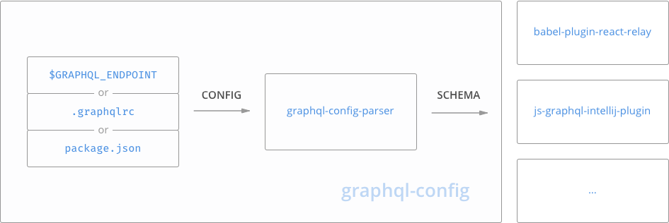

# graphql-config

The easiest way to configure your development environment with your GraphQL schema (supported by most tools, editors &amp; IDEs)

**TLDR**: Set an environment variable called `GRAPHQL_ENDPOINT` to your GraphQL endpoint (e.g. `https://your.api/graphql`) or read ahead for other configuration options.


## Supported by...

### Editors

* [js-graphql-intellij-plugin](https://github.com/jimkyndemeyer/js-graphql-intellij-plugin) - GraphQL language support for IntelliJ IDEA and WebStorm, including Relay.QL tagged templates in JavaScript and TypeScript (_pending_)
* [atom-language-graphql](https://github.com/rmosolgo/language-graphql) - GraphQL support for Atom text editor (_pending_)

### Tools

* [babel-plugin-react-relay](https://github.com/graphcool/babel-plugin-react-relay) - Babel compile step to process your `Relay.QL` queries
* [eslint-plugin-graphql](https://github.com/apollostack/eslint-plugin-graphql) - An ESLint plugin that checks tagged template strings against a GraphQL schema (_pending_)

> Did we forget a tool/editor? Please [add it here](https://github.com/graphcool/graphql-config/compare).

## Usage

You can either configure your GraphQL endpoint via a configuration file or by providing an environment variable.

> Note: This requires Node 5 installed or higher

### Method 1: Configuration via `$GRAPHQL_ENDPOINT` environment variable

The easiest way to configure your project is by setting an environment variable called `GRAPHQL_ENDPOINT` to your GraphQL endpoint.

```sh
export GRAPHQL_ENDPOINT="https://your.api/graphql"
```

### Method 2: Configuration via `.graphqlrc` file

You can either use your actual GraphQL endpoint or if preferred a local schema.json or schema.js file.

#### Use GraphQL endpoint

Note: The `headers` object is optional and can for example be used to authenticate to your GraphQL endpoint.

```json
{
  "request": {
    "url": "https://example.com/graphql",
    "headers": {
      "Authorization": "xxxxx"
    }
  }
}
```

#### Use local schema file (JSON)

```json
{
  "file": "./schema.json"
}
```

#### Use local schema file (GraphQL.js)

```json
{
  "graphql-js": "./schema.js"
}
```


### Method 3: Configuration via `package.json` file

Use the same configuration options as for the `.graphqlrc` file but wrap it into an object with the key `graphql`.

```json
{
  "dependencies": { ... },
  "graphql": {
    "request": {
      "url": "https://example.com/graphql"
    }
  }
}
```


## How it works

This project aims to be provide a unifying configuration file format to configure your GraphQL schema in your development environment.

Additional to the format specification, it provides the `graphql-config-parser` library, which is used by [all supported tools and editor plugins](#supported-by). The library reads your provided configuration and passes the actual GraphQL schema along to the tool which called it.



In case you provided a URL to your GraphQL endpoint, the `graphql-config-parser` library will run an [introspection query](https://github.com/graphql/graphql-js/blob/master/src/utilities/introspectionQuery.js) against your endpoint in order to fetch your schema.

## `graphql-config-parser` API [](https://travis-ci.org/graphcool/graphql-config) [](https://badge.fury.io/js/graphql-config-parser)

```js
import { parse, resolveSchema } from 'graphql-config-parser'

const config = parse()
resolveSchema(config)
  .then((schema) => {
    // use json schema for your tool/plugin
  })
  .catch((err) => {
    console.error(err)
  })
```

## Help & Community [](https://slack.graph.cool)

Join our [Slack community](http://slack.graph.cool/) if you run into issues or have questions. We love talking to you!


